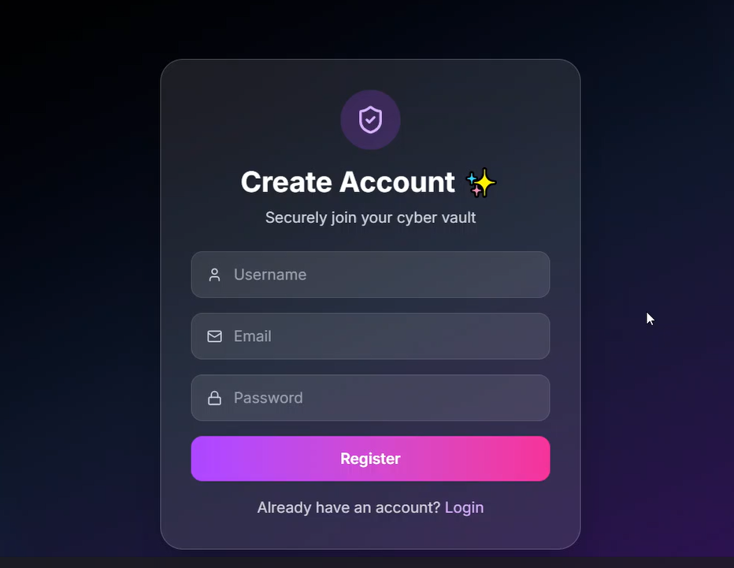
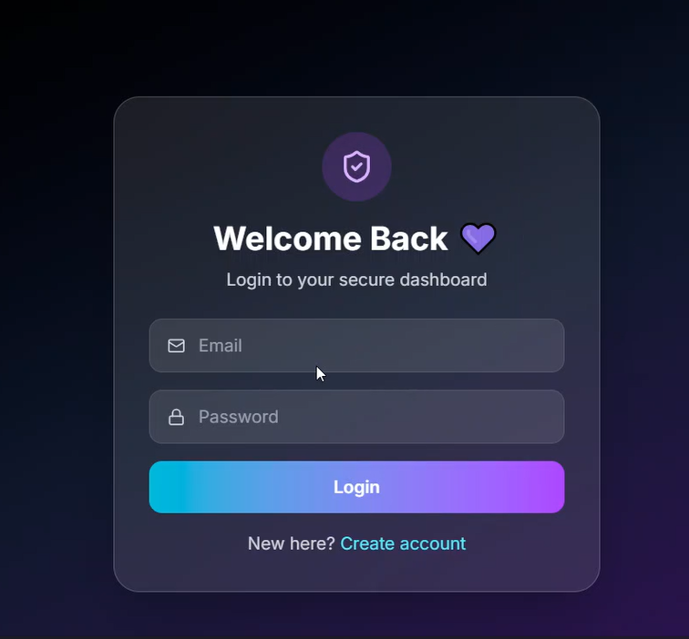
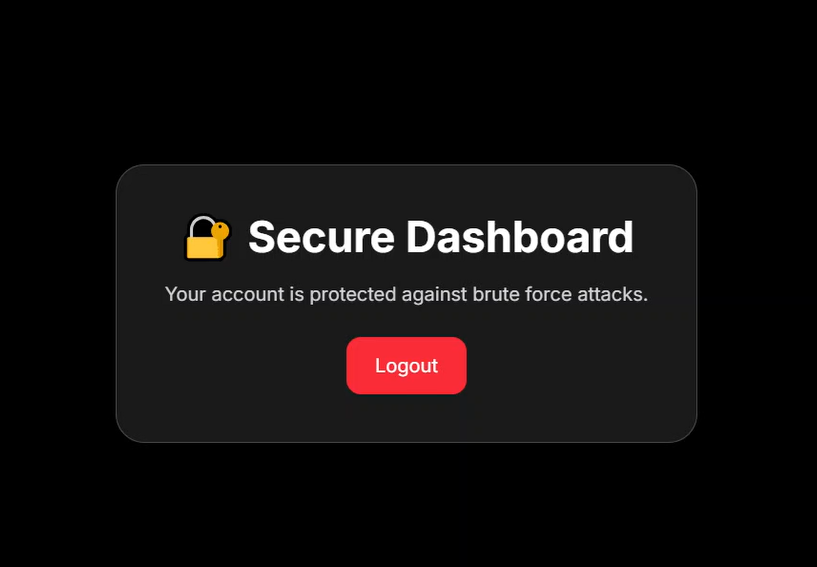
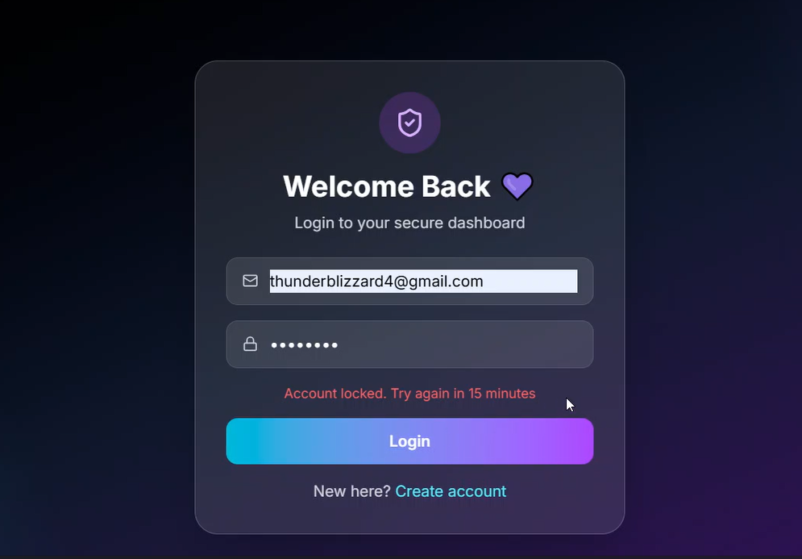

```
███████╗███████╗ ██████╗██╗   ██╗██████╗███████╗
██╔════╝██╔════╝██╔════╝██║   ██║██╔══██╗██╔════╝
███████╗█████╗  ██║     ██║   ██║██████╔╝█████╗
╚════██║██╔══╝  ██║     ██║   ██║██╔══██╗██╔══╝
███████║███████╗╚██████╗╚██████╔╝██║  ██║███████╗
╚══════╝╚══════╝ ╚═════╝ ╚═════╝ ╚═╝  ╚═╝╚══════╝

██╗      ██████╗  ██████╗ ██╗███╗   ██╗
██║     ██╔═══██╗██╔════╝ ██║████╗  ██║
██║     ██║   ██║██║  ███╗██║██╔██╗ ██║
██║     ██║   ██║██║   ██║██║██║╚██╗██║
███████╗╚██████╔╝╚██████╔╝██║██║ ╚████║
╚══════╝ ╚═════╝  ╚═════╝ ╚═╝╚═╝  ╚═══╝

███████╗██╗   ██╗███████╗████████╗███████╗███╗   ███╗
██╔════╝╚██╗ ██╔╝██╔════╝╚══██╔══╝██╔════╝████╗ ████║
███████╗ ╚████╔╝ ███████╗   ██║   █████╗  ██╔████╔██║
╚════██║  ╚██╔╝  ╚════██║   ██║   ██╔══╝  ██║╚██╔╝██║
███████║   ██║   ███████║   ██║   ███████╗██║ ╚═╝ ██║
╚══════╝   ╚═╝   ╚══════╝   ╚═╝   ╚══════╝╚═╝     ╚═╝
```

<div align="center">

# Secure Login System

***with Attack Prevention***

*A full-stack authentication system engineered with security-first principles —
brute force protection, JWT authentication, and encrypted credential storage.*

---

</div>

&nbsp;

═══════════════════════════════════════════════════════════
OVERVIEW
═══════════════════════════════════════════════════════════

This project is a production-ready secure authentication system built as part of an internship at **IncodeVision**. It demonstrates real-world security practices including password hashing, stateless JWT-based sessions, account lockout mechanisms, and API rate limiting — all integrated into a clean, modern full-stack application.

The system is designed to resist common attack vectors such as brute force login attempts, credential enumeration, and request flooding, while maintaining a smooth and responsive user experience.

&nbsp;

═══════════════════════════════════════════════════════════
OBJECTIVES
═══════════════════════════════════════════════════════════

- Implement secure user registration and login with encrypted password storage
- Issue and verify JWT tokens for stateless session management
- Enforce account lockout after repeated failed login attempts to prevent brute force attacks
- Apply global API rate limiting to protect against automated flooding
- Guard frontend routes so unauthenticated users cannot access protected pages
- Follow security best practices including generic error messages to prevent user enumeration

&nbsp;

═══════════════════════════════════════════════════════════
TOOLS & TECHNOLOGIES
═══════════════════════════════════════════════════════════

&nbsp;

**Frontend**


**Backend**


&nbsp;

═══════════════════════════════════════════════════════════
PROJECT STRUCTURE
═══════════════════════════════════════════════════════════

```
secure-login-system/
│
├── backend/
│   ├── config/
│   │   └── db.js
│   ├── controllers/
│   │   └── authController.js
│   ├── middleware/
│   │   ├── authMiddleware.js
│   │   └── rateLimiter.js
│   ├── models/
│   │   └── User.js
│   ├── routes/
│   │   └── authRoutes.js
│   ├── .env
│   ├── server.js
│   └── package.json
│
├── frontend/
│   ├── src/
│   │   ├── components/
│   │   │   ├── AuthLayout.jsx
│   │   │   ├── InputField.jsx
│   │   │   └── ProtectedRoute.jsx
│   │   ├── pages/
│   │   │   ├── Login.jsx
│   │   │   ├── Register.jsx
│   │   │   └── Dashboard.jsx
│   │   ├── App.jsx
│   │   ├── main.jsx
│   │   └── index.css
│   ├── index.html
│   ├── vite.config.js
│   └── package.json
│
├── Screenshots/
└── README.md
```

&nbsp;

═══════════════════════════════════════════════════════════
IMPLEMENTATION
═══════════════════════════════════════════════════════════

&nbsp;

**Password Security**

User passwords are never stored in plain text. On registration, bcrypt hashes each password with a salt round of 12 before it is saved to MongoDB. During login, bcrypt compares the submitted password against the stored hash — the original password is never recoverable.

&nbsp;

**JWT Authentication**

Upon successful login, the server signs a JSON Web Token containing the user's ID, valid for one hour. The frontend stores this token in localStorage and attaches it to protected requests via the Authorization header. The auth middleware on the backend verifies the token on every protected route.

&nbsp;

**Brute Force Protection**

Failed login attempts are tracked per user in MongoDB using `failedLoginAttempts` and `lockUntil` fields. After 5 consecutive failures, the account is locked for 15 minutes. Because the lock is persisted in the database, it survives server restarts and cannot be bypassed by simply refreshing.

&nbsp;

**Rate Limiting**

A global rate limiter restricts each IP address to 100 requests per 15-minute window using `express-rate-limit`. This prevents automated bots from flooding the API regardless of which endpoint they target.

&nbsp;

**Protected Routes**

The frontend `ProtectedRoute` component checks for a valid token in localStorage before rendering any protected page. If no token is found, the user is immediately redirected to the login page — direct URL navigation to `/dashboard` is blocked.

&nbsp;

═══════════════════════════════════════════════════════════
SCREENSHOTS
═══════════════════════════════════════════════════════════

&nbsp;

<div align="center">

| &nbsp; |
|:---:|
|  |
| *— **Registration Page** — clean form with real-time validation and inline error feedback —* |

&nbsp;

| &nbsp; |
|:---:|
|  |
| *— **Login Page** — JWT-based authentication with loading state and error handling —* |

&nbsp;

| &nbsp; |
|:---:|
|  |
| *— **Protected Dashboard** — accessible only with a valid token, redirects unauthenticated users —* |

&nbsp;

| &nbsp; |
|:---:|
|  |
| *— **Account Lockout** — triggered after 5 consecutive failed login attempts, persisted in MongoDB —* |

</div>

&nbsp;

═══════════════════════════════════════════════════════════
GETTING STARTED
═══════════════════════════════════════════════════════════

**1. Clone the repository**

```bash
git clone https://github.com/yourusername/secure-login-system.git
cd secure-login-system
```

**2. Install backend dependencies**

```bash
cd backend
npm install
```

**3. Configure environment variables**

Create a `.env` file inside the `backend` folder:

```env
MONGO_URI=your_mongodb_connection_string
JWT_SECRET=your_secret_key
```

Generate a secure JWT secret:

```bash
node -e "console.log(require('crypto').randomBytes(64).toString('hex'))"
```

**4. Install frontend dependencies**

```bash
cd ../frontend
npm install
```

**5. Run the application**

```bash
# Terminal 1 — Backend
cd backend
npm run dev

# Terminal 2 — Frontend
cd frontend
npm run dev
```

**6. Open in browser**

```
http://localhost:5173
```

&nbsp;

═══════════════════════════════════════════════════════════
CONCLUSION
═══════════════════════════════════════════════════════════

This project demonstrates how layered security measures work together in a real application. Rather than treating security as an afterthought, each component — from password hashing to route protection — was designed with a specific threat in mind.

Through building this system, I gained hands-on experience with JWT authentication flows, bcrypt hashing, MongoDB schema design for security state, and how to structure a full-stack application following separation of concerns.

The result is a clean, functional, and genuinely secure authentication system ready to serve as the foundation for any production application.

&nbsp;

---

<div align="center">

*Developed as part of an internship at* ***IncodeVision***

</div>
